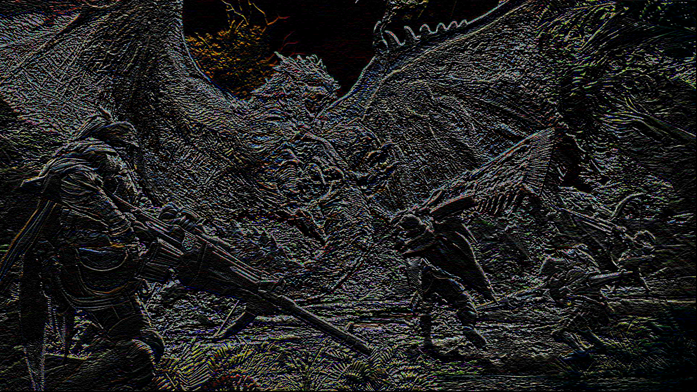

# Quick Start

编辑Makefile ,将其中OpenCL 与 OpenCV 的lib目录填入：

例如：

```
OPENCL = -I/usr/local/include -L/usr/local/cuda/lib64 -lOpenCL 
OPENCV = $(shell pkg-config opencv --cflags --libs)
```

运行脚本：

```
./run.sh
```

图片目录：pics/

卷积核目录：filters/

只保留源码：

```
make clean
```


#  结果分析


## pic1 500*308

| cpu  | gpu  | gpu2(local memory) | gpu3(多任务) |
| ---- | ---- | ------------------ | ------------ |
| 28   | 26   | 0.3                | 1            |

## pic2 1920*1080

| cpu  | gpu  | gpu2(local memory) | gpu3(多任务) |
| ---- | ---- | ------------------ | ------------ |
| 378  | 25   | 2.7                | 8            |

## pic3 3840*1920

| cpu  | gpu  | gpu2(local memory) | gpu3(多任务) |
| ---- | ---- | ------------------ | ------------ |
| 1484 | 26   | 10                 | 21           |


# 图片展示

## pic1 500*308 


## pic2 1920*1080





## pic3 3840*1920


